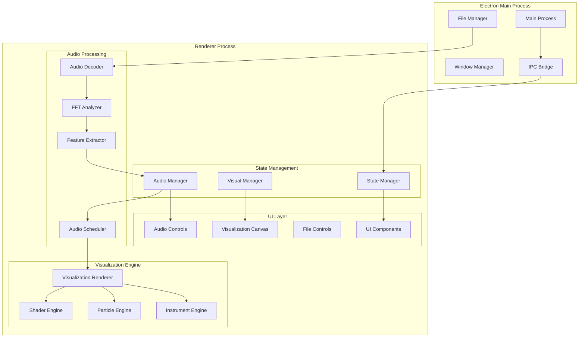
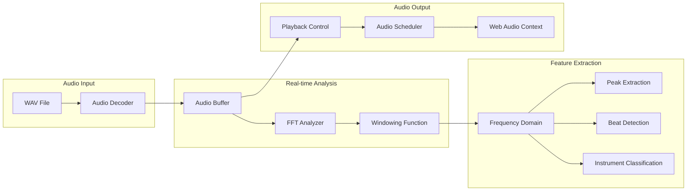
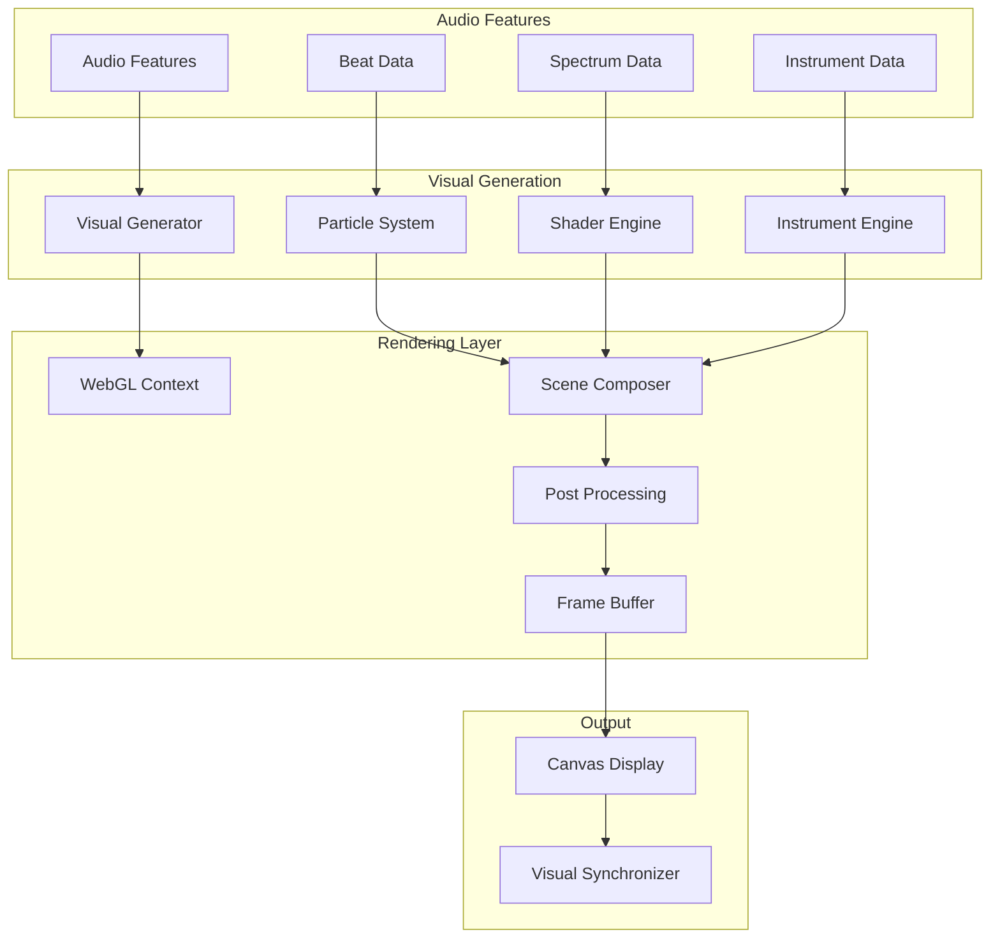
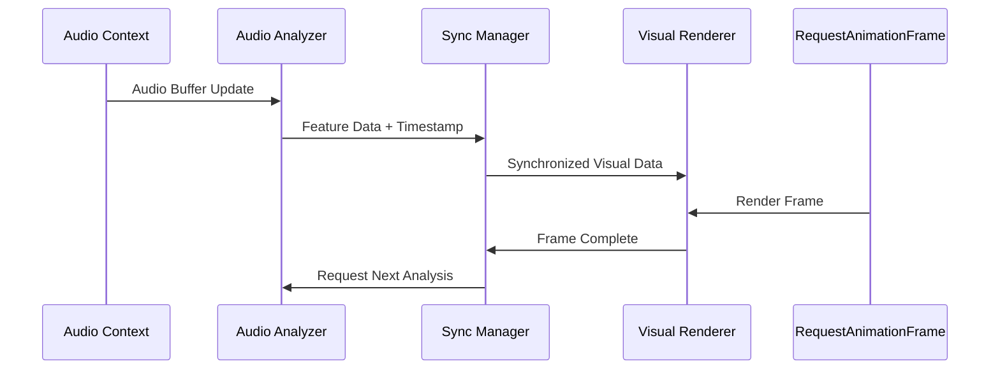
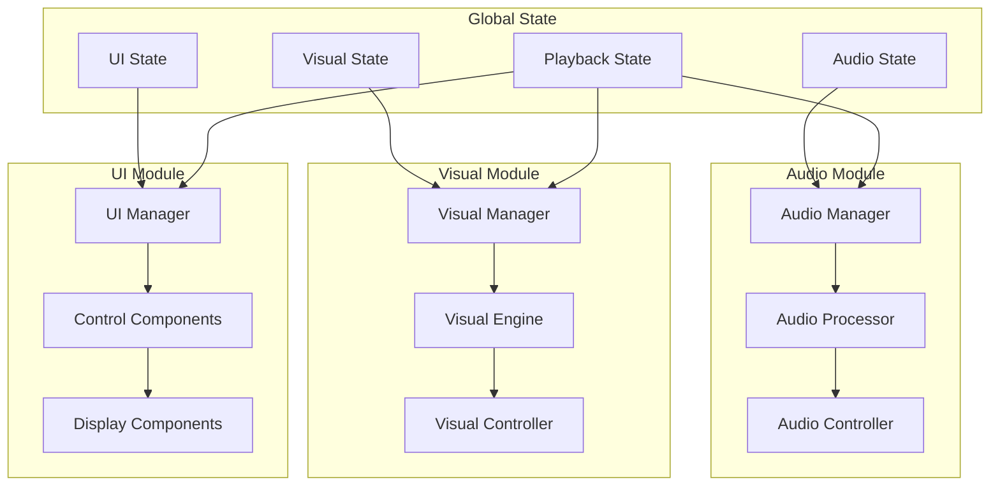
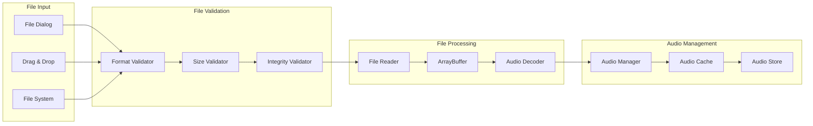
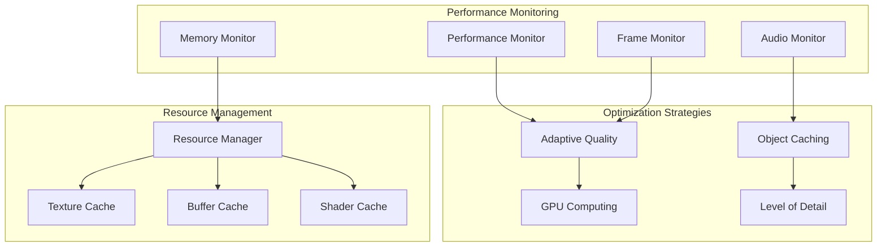
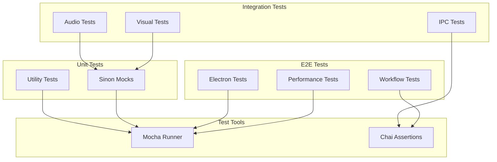

# Music Visualizer Frontend Architecture Plan

## Project Overview

The Music Visualizer is an Electron application that creates ethereal, psychedelic, cosmic visual effects synchronized to musical compositions. The application analyzes WAV files, provides audio playback controls, and generates real-time visualizations with transparent instrument figures based on the current musical content.

## System Architecture

### Overall Application Architecture



### Technology Stack

#### Core Technologies
- **Electron**: v27+ for cross-platform desktop application
- **TypeScript**: v5+ for type-safe development
- **Node.js**: v18+ for main process operations

#### Audio Processing
- **Web Audio API**: Native browser audio processing
- **FFT.js**: Fast Fourier Transform library for frequency analysis
- **AudioBuffer**: For audio data manipulation
- **MediaElementAudioSourceNode**: For audio file playback

#### Visualization Rendering
- **WebGL 2.0**: Hardware-accelerated graphics rendering
- **Three.js**: 3D graphics library for complex visualizations
- **GLSL Shaders**: Custom fragment and vertex shaders
- **Canvas 2D**: Fallback for simple overlays

#### Testing Framework
- **Mocha**: Test runner
- **Sinon**: Mocking and stubbing
- **Chai**: Assertion library
- **Electron Test**: Electron-specific testing utilities

#### Build & Development
- **Webpack**: Module bundling
- **TypeScript Compiler**: Type checking and compilation
- **ESLint**: Code linting
- **Prettier**: Code formatting

## Audio Processing Pipeline

### Architecture Components



### Implementation Details

#### Audio Decoder Service
```typescript
interface AudioDecoderService {
  loadWavFile(filePath: string): Promise<AudioBuffer>;
  validateAudioFormat(file: File): boolean;
  extractMetadata(audioBuffer: AudioBuffer): AudioMetadata;
}
```

#### FFT Analyzer
```typescript
interface FFTAnalyzer {
  analyzeFrequencies(audioData: Float32Array): FrequencyData;
  getSpectrum(fftSize: number): Float32Array;
  detectBeats(frequencyData: FrequencyData): BeatEvent[];
  classifyInstruments(spectrum: Float32Array): InstrumentData[];
}
```

#### Feature Extraction Pipeline
- **Windowing**: Hamming window function for spectral analysis
- **Frequency Bins**: 2048-point FFT for detailed frequency resolution
- **Beat Detection**: Onset detection using spectral flux
- **Instrument Classification**: Machine learning-based instrument recognition
- **Tempo Analysis**: Real-time BPM detection

## Visual Rendering Architecture

### Rendering Pipeline



### Visualization Components

#### Particle System Engine
```typescript
interface ParticleSystemEngine {
  createParticles(count: number, type: ParticleType): Particle[];
  updateParticles(deltaTime: number, audioFeatures: AudioFeatures): void;
  renderParticles(renderer: WebGLRenderer): void;
  applyForces(particles: Particle[], forces: ForceField[]): void;
}
```

#### Shader Management
```typescript
interface ShaderEngine {
  loadShader(type: ShaderType, source: string): WebGLShader;
  createProgram(vertexShader: WebGLShader, fragmentShader: WebGLShader): WebGLProgram;
  updateUniforms(program: WebGLProgram, uniforms: UniformData): void;
  bindTextures(textures: WebGLTexture[]): void;
}
```

#### Instrument Visualization
```typescript
interface InstrumentEngine {
  renderInstrumentShadow(instrument: InstrumentType, opacity: number): void;
  animateInstrumentPresence(instruments: InstrumentData[]): void;
  createEtherealEffects(intensity: number): Effect[];
  synchronizeWithAudio(audioFeatures: AudioFeatures): void;
}
```

### Visual Effects Design

#### Ethereal Effects
- **Particle Clouds**: Floating particles responding to frequency changes
- **Energy Waves**: Rippling effects synchronized to bass frequencies
- **Color Gradients**: Dynamic color palettes based on harmonic content
- **Atmospheric Fog**: Depth-based fog effects for cosmic atmosphere

#### Psychedelic Elements
- **Fractal Patterns**: Mathematical patterns responding to musical structure
- **Kaleidoscope Effects**: Symmetrical visual patterns
- **Color Cycling**: Smooth color transitions based on musical progression
- **Distortion Effects**: Reality-bending visual distortions

#### Cosmic Themes
- **Star Fields**: Dynamic star patterns responding to high frequencies
- **Nebula Clouds**: Gaseous cloud effects for ambient sections
- **Galaxy Spirals**: Rotating spiral patterns for rhythmic sections
- **Planetary Bodies**: 3D spherical objects for bass emphasis

## Real-time Synchronization

### Synchronization Architecture



### Timing and Synchronization

#### Audio-Visual Sync Manager
```typescript
interface SyncManager {
  synchronizeAudioVisual(audioTime: number, visualTime: number): void;
  compensateLatency(latencyMs: number): void;
  scheduleVisualEvents(events: VisualEvent[]): void;
  maintainFrameRate(targetFPS: number): void;
}
```

#### Performance Timing
- **Audio Latency**: ~20ms buffer for real-time processing
- **Visual Latency**: Compensated through predictive rendering
- **Frame Rate**: Target 60 FPS with adaptive quality scaling
- **Sync Accuracy**: ±5ms tolerance for audio-visual alignment

## State Management and Data Flow

### State Architecture



### State Management Implementation

#### Central State Store
```typescript
interface AppState {
  audio: AudioState;
  visual: VisualState;
  ui: UIState;
  playback: PlaybackState;
}

interface StateManager {
  getState(): AppState;
  setState(partialState: Partial<AppState>): void;
  subscribe(listener: StateListener): Unsubscribe;
  dispatch(action: Action): void;
}
```

#### Audio State
```typescript
interface AudioState {
  currentFile: AudioFile | null;
  isPlaying: boolean;
  currentTime: number;
  duration: number;
  volume: number;
  frequencyData: FrequencyData;
  instrumentData: InstrumentData[];
  beatData: BeatData;
}
```

#### Visual State
```typescript
interface VisualState {
  currentVisualization: VisualizationType;
  effects: EffectState[];
  particles: ParticleState[];
  colors: ColorPalette;
  intensity: number;
  performance: PerformanceMetrics;
}
```

## Component Hierarchy

### Main Application Structure

```
App
├── AudioControlPanel
│   ├── FileSelector
│   ├── PlaybackControls
│   │   ├── PlayButton
│   │   ├── PauseButton
│   │   ├── StopButton
│   │   └── SeekBar
│   ├── VolumeControl
│   └── AudioAnalyzer
├── VisualizationCanvas
│   ├── WebGLRenderer
│   ├── ParticleSystem
│   ├── ShaderManager
│   └── EffectComposer
├── VisualizationControls
│   ├── EffectSelector
│   ├── IntensitySlider
│   ├── ColorPicker
│   └── PresetManager
└── StatusBar
    ├── PlaybackInfo
    ├── PerformanceMetrics
    └── FileInfo
```

### Component Implementation

#### Audio Control Panel
```typescript
interface AudioControlPanelProps {
  audioState: AudioState;
  onFileSelect: (file: File) => void;
  onPlaybackControl: (action: PlaybackAction) => void;
  onVolumeChange: (volume: number) => void;
}
```

#### Visualization Canvas
```typescript
interface VisualizationCanvasProps {
  visualState: VisualState;
  audioFeatures: AudioFeatures;
  canvasRef: React.RefObject<HTMLCanvasElement>;
  onRenderComplete: () => void;
}
```

## File Handling Architecture

### File Processing Pipeline



### File Handling Implementation

#### File Manager Service
```typescript
interface FileManagerService {
  openFileDialog(): Promise<File | null>;
  validateAudioFile(file: File): ValidationResult;
  loadAudioFile(file: File): Promise<AudioBuffer>;
  cacheAudioData(id: string, data: AudioBuffer): void;
  getCachedAudio(id: string): AudioBuffer | null;
}
```

#### Supported Formats
- **Primary**: WAV files (16-bit, 24-bit, 32-bit)
- **Sample Rates**: 44.1kHz, 48kHz, 96kHz, 192kHz
- **Channels**: Mono, Stereo
- **File Size**: Up to 200MB for optimal performance

## Performance Optimization

### Performance Architecture



### Optimization Strategies

#### Real-time Performance
- **Adaptive Quality**: Dynamic quality scaling based on performance
- **GPU Acceleration**: WebGL-based rendering for complex visualizations
- **Audio Buffer Optimization**: Efficient audio data processing
- **Memory Pool Management**: Pre-allocated object pools

#### Resource Management
```typescript
interface ResourceManager {
  allocateTexture(size: TextureSize): WebGLTexture;
  deallocateTexture(texture: WebGLTexture): void;
  manageMemoryUsage(): MemoryStats;
  optimizePerformance(metrics: PerformanceMetrics): void;
}
```

#### Performance Targets
- **Frame Rate**: 60 FPS stable, 30 FPS minimum
- **Audio Latency**: <50ms total latency
- **Memory Usage**: <500MB typical, <1GB maximum
- **CPU Usage**: <50% on modern hardware

## Testing Architecture

### Testing Strategy



### Test Implementation

#### Audio Processing Tests
```typescript
describe('AudioProcessor', () => {
  let audioProcessor: AudioProcessor;
  let mockAudioContext: sinon.SinonStubbedInstance<AudioContext>;
  
  beforeEach(() => {
    mockAudioContext = sinon.createStubInstance(AudioContext);
    audioProcessor = new AudioProcessor(mockAudioContext);
  });
  
  it('should analyze audio frequencies correctly', () => {
    const audioData = new Float32Array([/* test data */]);
    const result = audioProcessor.analyzeFrequencies(audioData);
    
    expect(result.frequencies).to.be.an('array');
    expect(result.frequencies.length).to.equal(1024);
  });
});
```

#### Visual Rendering Tests
```typescript
describe('VisualizationRenderer', () => {
  let renderer: VisualizationRenderer;
  let mockWebGLContext: sinon.SinonStubbedInstance<WebGLRenderingContext>;
  
  beforeEach(() => {
    mockWebGLContext = sinon.createStubInstance(WebGLRenderingContext);
    renderer = new VisualizationRenderer(mockWebGLContext);
  });
  
  it('should render particles based on audio features', () => {
    const audioFeatures = { /* mock audio features */ };
    const particleCount = renderer.renderFrame(audioFeatures);
    
    expect(particleCount).to.be.greaterThan(0);
  });
});
```

#### Testing Coverage Plan
- **Unit Tests**: 90% code coverage for core modules
- **Integration Tests**: Audio-visual synchronization, file handling
- **E2E Tests**: Complete user workflows, performance benchmarks
- **Performance Tests**: Frame rate stability, memory usage limits

## Implementation Phases

### Phase 1: Foundation (Weeks 1-2)
- Set up Electron application structure
- Implement basic TypeScript configuration
- Create core state management system
- Set up build and development tooling
- Implement basic file handling

### Phase 2: Audio Processing (Weeks 3-4)
- Implement WAV file decoder
- Create FFT analysis pipeline
- Build feature extraction system
- Implement beat detection
- Add basic audio playback controls

### Phase 3: Visual Engine (Weeks 5-6)
- Set up WebGL rendering context
- Implement particle system engine
- Create shader management system
- Build basic visualization effects
- Implement instrument shadow rendering

### Phase 4: Synchronization (Week 7)
- Implement audio-visual synchronization
- Create timing compensation system
- Build performance monitoring
- Optimize real-time processing

### Phase 5: Advanced Visualizations (Weeks 8-9)
- Implement ethereal effects
- Add psychedelic visual patterns
- Create cosmic-themed visualizations
- Build instrument classification system

### Phase 6: UI and Controls (Week 10)
- Implement complete UI components
- Add visualization controls
- Create preset management system
- Build status and information displays

### Phase 7: Testing and Optimization (Weeks 11-12)
- Comprehensive testing implementation
- Performance optimization
- Bug fixes and refinements
- Documentation completion

### Phase 8: Final Integration (Week 13)
- End-to-end testing
- Performance validation
- User acceptance testing
- Release preparation

## Timeline and Deliverables

### Milestone Schedule

| Phase | Duration | Key Deliverables |
|-------|----------|------------------|
| Foundation | 2 weeks | Basic app structure, state management |
| Audio Processing | 2 weeks | WAV analysis, playback controls |
| Visual Engine | 2 weeks | WebGL renderer, particle system |
| Synchronization | 1 week | Audio-visual sync, performance monitoring |
| Advanced Visuals | 2 weeks | Ethereal effects, instrument shadows |
| UI and Controls | 1 week | Complete user interface |
| Testing | 2 weeks | Comprehensive test suite |
| Integration | 1 week | Final testing and optimization |

### Success Criteria

#### Technical Requirements
- ✅ Real-time audio analysis and visualization
- ✅ Smooth 60 FPS rendering performance
- ✅ Audio-visual synchronization within 5ms
- ✅ Support for various WAV formats
- ✅ Ethereal, psychedelic, cosmic visual effects
- ✅ Transparent instrument figure rendering

#### Quality Requirements
- ✅ 90% test coverage for core modules
- ✅ TypeScript strict mode compliance
- ✅ Performance targets met consistently
- ✅ Cross-platform Electron compatibility
- ✅ Memory usage within defined limits

#### User Experience Requirements
- ✅ Intuitive audio file loading
- ✅ Responsive playback controls
- ✅ Smooth visual transitions
- ✅ Customizable visualization effects
- ✅ Real-time performance feedback

## Risk Assessment and Mitigation

### Technical Risks
1. **Audio Processing Performance**: Mitigation through WebWorkers and optimized algorithms
2. **WebGL Compatibility**: Fallback to Canvas 2D for unsupported systems
3. **Memory Leaks**: Comprehensive resource management and testing
4. **Synchronization Accuracy**: Multiple timing strategies and calibration

### Performance Risks
1. **Frame Rate Drops**: Adaptive quality scaling and performance monitoring
2. **Audio Latency**: Optimized buffer management and processing pipelines
3. **Memory Usage**: Efficient caching and garbage collection strategies

### Development Risks
1. **Complexity Management**: Modular architecture and clear interfaces
2. **Testing Coverage**: Automated testing and continuous integration
3. **Timeline Adherence**: Regular milestone reviews and scope management

This comprehensive architecture plan provides a solid foundation for building a high-performance Music Visualizer Electron application with advanced audio processing and ethereal visual effects, ensuring both technical excellence and user experience quality.